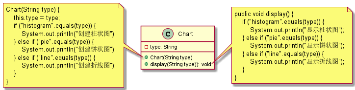
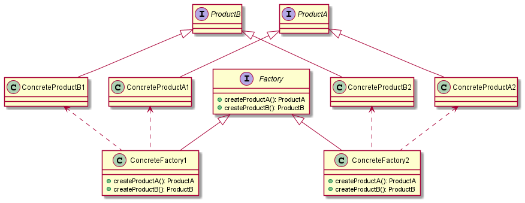
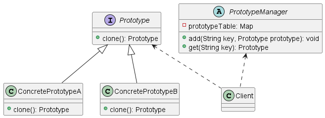

# 设计模式

## 1. 面向对象设计原则

### 1.1 单一职责原则

单一职责原则（Single Responsibility Principle，SRP）：一个类只负责一个功能领域中的相应职责，或者就一个类而言，应该只有一个引起它的变化。

现有一个CustomerDataChart客户信息图表类，getConnection()方法获取数据库连接，findCustomers()方法从数据库查找客户信息，createChart()方法创建图表，displayChart()方法显示图表。


利用单一职责原则对CustomerDataChart进行拆分：DBUtil类负责数据库连接，CustomerDAO扶着数据库数据查询，CustomerDataChart类负责创建图表和显示图表。


### 1.2 开闭原则

开闭原则（Open-Closed Principle，OCP）：一个软件实体对拓展开放，对修改关闭。即软件实体应该在尽量不修改原有代码的情况下进行拓展。
在开闭原则中，软件实体可以指一个软件模块、一个由多个类组成的局部结构、一个独立的类。

现有一个可以显示各类图表的类ChartDisplay，另外有用于显示柱状图(BarChart)和饼状图(PieChart)类


进行重构使之符合开闭原则：AbstractChart抽象图表类，各种具体类型图表则作为其子类；ChartDisplay类针对抽象图表进行编程，由客户端来决定使用具体的图表。


### 1.3 里氏替换原则

里氏替换原则（Likov Substitution Principle，LSP）：所有引用基类（父类）的地方必须能透明地使用其子类的对象。

现有普通客户类CommonCustomer和VIP客户类VIPCustomer，和一个EmailSender邮件发送类


根据里氏替换原则重构：增加客户抽象类Customer，CommonCustomer和VIPCustomer继承自Customer，EmailSender发送邮件的方法只需要是Customer方法，因为能使用父类的地方，子类必须能透明地使用。


### 1.4 依赖倒转原则

依赖倒转原则（Dependency Inversion Principle，DIP）：抽象不应该依赖于细节，细节应当依赖于抽象。即针对接口编程，而不是针对实现编程。

依赖倒转原则要求在程序中传递参数时或者关联关系中，尽量引用层次高的抽象类，即使用接口和抽象类进行变量类型声明、参数类型声明、方法返回类型声明。

在实现依赖倒转原则时，会通过依赖注入的方式注入到其它对象中。依赖注入（Dependency Injection，DI）是将一个对象引用到声明的抽象类，常用的注入方式有：构造注入、设值注入、接口注入。

现有Txt文件读取数据类TXTDataConvertor和Excel读取数据类ExcelDataConvertor，持久类CustomerDAO。


根据依赖倒转原则：增加抽象类DataConvertor，TXTDataConvertor和ExcelDataConvertor继承自DataConvertor，CustomerDAO依赖于抽象类，则可根据具体实现选择转换类。


### 1.5 接口隔离原则

接口隔离原则（Interface Segregation Principle，ISP）：使用多个专门的接口，而不使用单一的总接口，即客户端不应该依赖那些它不需要的接口。

现有接口ConcreteClass有5个方法，其实现类CustomerDataDisplay，客户端Client使用接口，实际发现CustomerDataDisplay有可能只需要其中某几个方法，而其他的方法不需要。


根据接口隔离原则：将ConcreteClass拆分成4个接口DataHandler、XmlTransformer、ChartHandler、ReportHandler，实现类ConcreteClass可根据自身需求选择实现的接口。


### 1.6 迪米特法则

迪米特法则（Law of Demeter，LoD）：一个软件实体应该尽可能少的地与其他实体发生相互作用。
迪米特法则也被定义为：不要和陌生人说话、只与直接朋友通信。在迪米特法则中，朋友包括：
1. 当前对象本身（this）
2. 以参数形式传入当前对象方法中的对象
3. 当前对象的成员变量
4. 当前对象所创建的对象
5. 当前对象的成员变量是集合，那集合中的元素也是朋友

现有一个Button控件，点击Button时，List、ComboBox、TextBox、Label都会做出改变，关系如下图：


经由迪米特法则修改：引入一个Mediator中间类降低组件之间的耦合度，控件之间不发生直接引用，而是将请求先转发给中间类，再由中间类完成其它组件的调用


### 1.7 合成复用原则

合成复用原则（Composition Reuse Principle，CRP）：尽量使用对象组合，而不是通过继承达到复用的目的。

现有数据库连接工具类DBUtil，客户持久类CustomerDAO，CustomerDAO通过继承DBUtil的方式复用连接数据库的代码。


由合成复用原则改进：DBUtil作为基类，分别有OracleDBUtil和MysqlDBUtil继承自DBUtil，CustomerDAO通过注入DBUtil的方式完成代码的复用。


## 2. 简单工厂模式

### 2.1 案例

有一个Chart图表类用于创建和显示各类图表，如饼状图、柱状图、折线图等。



从类图中可以看出Chart类的职责很多，且当需要拓展一种图表时，调用方和被调用方都需要修改源代码，不符合开闭原则。

### 2.2 定义

简单工厂模式（Simple Factory Pattern）：定义一个工厂类，它可以根据不同的参数返回不同类的实例，被创建的实例通常继承自同一个父类，简单工厂模式通常用静态方法创建实例，所以也被称为静态工厂方法模式。

### 2.3 类图


### 2.4 说明

1. Factory（工厂角色）：工厂类，负责实现创建所有产品实例的内部逻辑；工厂类可以被外部直接调用，创建所需的产品对象；工厂类的静态方法factoryMethod返回产品的抽象类Product。
2. Product（抽象产品角色）：工厂类创建的所有对象的父类，封装了各种产品对象的公有方法，它的引入提高了系统的灵活性，使得工厂类中只需要定义一个通用的工厂方法。
3. ConcreteProduct（具体产品角色）：简单工厂方法的创建目标，每一个具体产品类都继承自抽象产品类。

### 2.5 案例应用


## 3. 工厂方法模式

### 3.1 案例

有一个由简单工厂模式实现的Logger类。


从类图中可以看出，当需要添加一个日志器类型时，需要修改业务代码，而且工厂类也不易于拓展。

### 3.2 定义

工厂方法模式（Factory Method Pattern）：定义一个用于创建工厂的抽象工厂接口，让子类决定将哪一个类实例化。

### 3.3 类图


### 3.4 说明

1. Product（抽象产品）：定义产品的接口，是工厂方法所创建的对象的超类型，即产品对象的公共父类
2. ConcreteProduct（具体产品）：实现抽象产品接口，某种具体产品由专门的具体工厂创建，具体工厂和具体产品一一对应
3. Factory（抽象工厂）：声明工厂方法，用于返回具体产品，所有创建对象的工厂都要实现抽象工厂
4. ConcreteFactory（具体工厂）：实现抽象工厂接口，并由客户都拿调用，返回一个具体产品类的实例对象

### 3.5 案例应用


## 4. 抽象工厂模式

### 4.1 案例

界面有Button、TextField、ComboBox三种控件，有两组主题：Spring和Summer。


从类图中可以看出，需要增加一个主题时，需要创建对应的具体主题类和具体工厂类，而且应用同一个主题风格的控件，客户端需要逐一调用每个主题工厂。

### 4.2 定义

抽象工厂模式（Abstract Factory Pattern）：提供一个创建一系列相关或互相依赖对象的接口，而无须指定具体的类。在抽象工厂模式中，每一个具体工厂都提供了多个工厂方法用于生产多种不同类型的同系列产品，即产品族。

### 4.3 类图



### 4.4 说明

1. AbstractFactory（抽象工厂）：声明一组用于创建一系列产品的方法，每个方法对应一个产品。
2. ConcreteFactory（具体工厂）：实现了抽象工厂声明的方法，生成一组具体的产品，这些产品组成了一个产品族。
3. AbstractProduct（抽象产品）：声明了产品的具体业务方法。
4. ConcreteProduct（具体产品）：定义具体工厂生产的具体产品对象，实现抽象产品接口中声明的业务方法。

### 4.5 案例应用


## 5. 单例模式

### 5.1 案例

有一个任务管理器，为了节省资源，系统中应当只有一个任务管理器实例，任务管理器有displayProcesses、displayServices等多个方法，类如下示意：

```java
class TaskManager {
    public TaskManager() {}
    public void displayProcesses() { }
    public void displayServices() { }
}
```

### 5.2 定义

单例模式（Singleton Pattern）：保证类在系统中的唯一性。

### 5.3 步骤

为保证类的唯一性，需要将构造方法的访问修饰符修改为`private`，使外部无法使用new操作符创建多个对象。
构造方法私有后，对外提供一个获取唯一对象的静态方法，以及一个保存唯一对象的实例。
```java
class TaskManager {
    private static TaskManager instance = null;
    
    public static TaskManager getInstance() {
        if (instance == null) {
            instance = new TaskManager();
        }
        return instance;
    }
    
    private TaskManager() {}
    public void displayProcesses() { }
    public void displayServices() { }
}
```
上述实现在单线程环境下可以满足基本的需求，但是在多线程环境下则存在线程安全问题。

### 5.4 补充
1. 饿汉式
```java
class Singleton {
    private static final Singleton instance = new Singleton();
    
    private Singleton() { }
    
    public static Singleton getInstance() {
        return instance;
    }
}
```

2. 懒汉式

```java
class Singleton {
    private static Singleton instance = null;

    private Singleton() { }

    public static Singleton getInstance() {
        if (instance == null) {
            synchronized (Singleton.class) {
                instance = new Singleton();
            }
        }
        return instance;
    }
}
```
> 多线程环境下存在线程安全问题，如果两个线程同时调用getInstance()方法，第一个线程上锁，第二个线程在同步队列等待；第一个线程创建实例后退出，第二个线程执行同步代码块并不知道实例已经创建。

3. 双重检查锁定
```java
class Singleton {
    private static volatile Singleton instance = null;

    private Singleton() { }

    public static Singleton getInstance() {
        if (instance == null) {
            synchronized (Singleton.class) {
                if (instance == null) {
                    instance = new Singleton();
                }
            }
        }
        return instance;
    }
}
```

4. 静态内部类
```java
class Singleton {
    private Singleton() { }
    
    private static class SingletonHolder {
        private final static Singleton instance = new Singleton();
    }
    
    public static Singleton getInstance() {
        return SingletonHolder.instance;
    }
}
```
> 初次加载单例类时，不会初始化创建单例实例，在调用getInstance时，由JVM完成静态内部类的初始化，这一过程JVM保证线程安全。

5. 枚举
```java
enum Singleton {
    INSTANCE
}
```
> 枚举由JVM提供线程安全和保证唯一对象

## 6. 原型模式

### 6.1 案例

公司需要填写周报，但是周报的内容有些大同小异，每次填写时都需要重新开始填写，极大地增加了工作量。周报类（WeekLog）是周报的内容，需要根据已有的周报模板复制一份周报进行简单的修改即可作为一份新的可用周报。

### 6.2 定义

原型模式（Prototype Pattern）：使用原型实例指定创建对象的总类，并且通过拷贝原型创建新对象。

### 6.3 类图


### 6.4 说明

1. Prototype（抽象原型）：声明克隆方法的接口，是所有具体原型的公共父类，可以是抽象类，也可以是接口，甚至可以是具体实现类。
2. ConcretePrototype（具体原型类）：实现在抽象原型类中的克隆方法，在克隆方法中返回自己的一个克隆对象。
3. Client（客户类）：让一个原型对象克隆自身从而创建一个新的对象，在客户类中只需要直接实例化或者通过工厂方法等方式创建一个原型对象，再通过调用该对象的克隆方法即可得到多个相同对象。

### 6.5 拓展

添加一个原型对象管理器，将可作为原型的对象存储在一个集合中供客户端使用，是专门负责克隆对象的工厂。



## 7. 建造者模式

### 7.1 案例

游戏角色由身体的各个部位组成，角色之间存在差异，但是各种角色的创建过程都大同小异，都需要创建各个组成部分，再组成一个完整的角色。

### 7.2 定义

建造者模式（Builder Pattern）：将一个复杂对象的构建与它的表示分离，使得同样的构建过程可以创建不同的表示，建造者模式是一种对象创建型模式。

### 7.3 类图


### 6.4 说明

1. Builder（抽象建造者）：为创建产品Product对象的各个部件指定抽象接口，在该接口中一般声明两类方法，一类方法是buildPartX()，用于创建复杂对象的各个部件；另一类方法是getResult()，用于返回复杂对象。Builder既可以是抽象类，也可以是接口。
2. ConcreteBuilder（具体创建者）：实现Builder接口，实现各个具体构造和装配方法，定义并明确它所创建的复杂对象，也可以提供一个方法返回创建好的复杂产品对象。
3. Product（产品角色）：它是被构建的复杂对象，包含多个组成部件，具体创建者创建该产品的内部表示并定义它的装配过程。
4. Director（指挥者）：它负责安排复杂对象的建造次序，指挥者与抽象建造者之间存在关联关系，可以在其construct()建造方法中调用建造者对象的部件构造与装配方法，完成复杂对象的建造。客户端一般只需要与指挥者进行交互，在客户端确定具体建造者的类型，并实例化具体建造者对象，然后注入到Director中。

